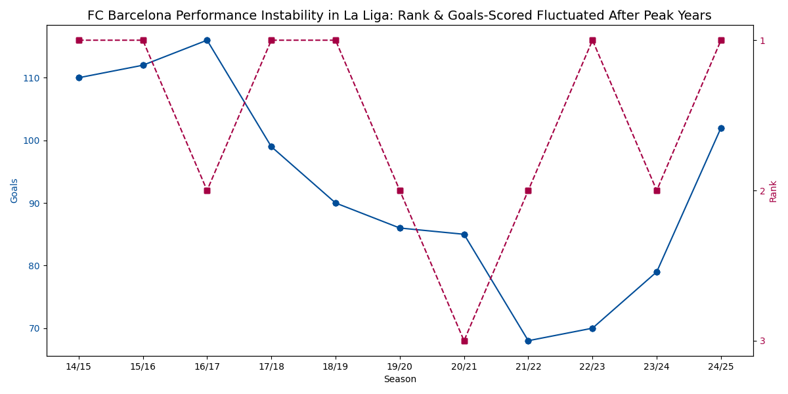
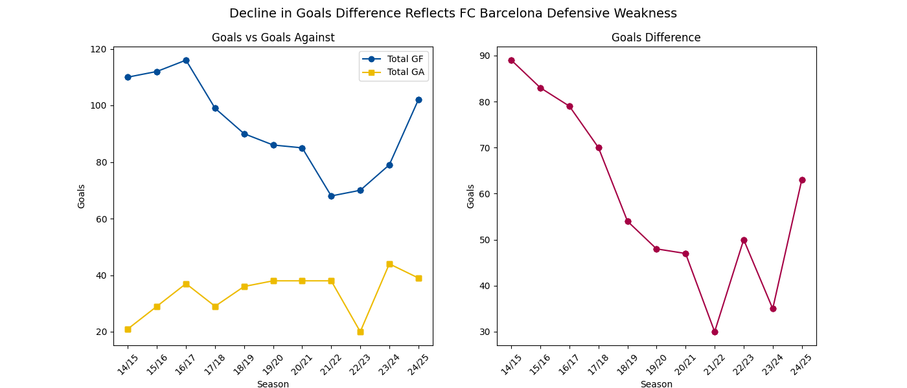
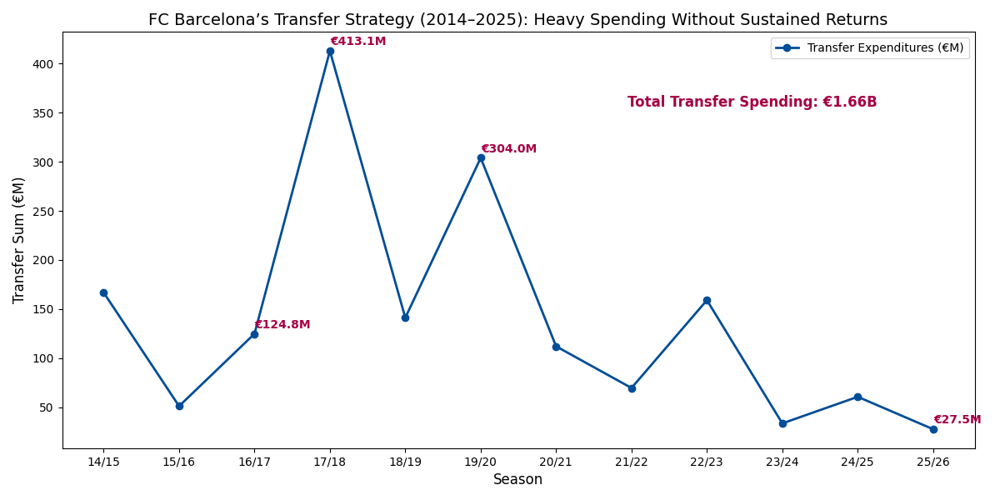
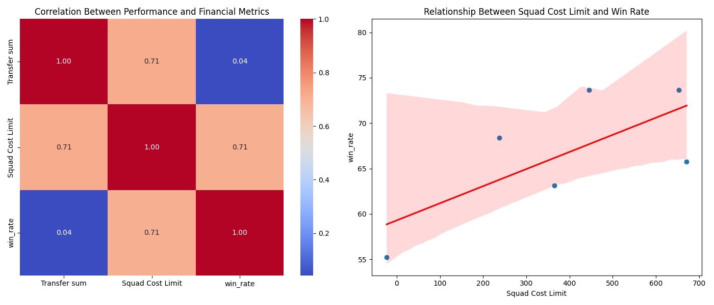

  

    
  

  <h1 style="border: none; padding: 0; margin: 0;">
    Performance and Financial Analysis of FC Barcelona
  </h1>
  <h2 style="font-size: 22px;">
    A Decade of Evolution, Challenges, and Strategic Insights
  </h2>

<h2 align="center"> Background & Overview </h2>

 
  After the historic treble in 2014/15, FC Barcelona faced a decade of highs and lows. On-field performance fluctuated, defensive stability declined, and financial instability forced major structural adjustments. As a long-time FC Barcelona supporter, I became fascinated by how the club’s on-field decline contrasted with its historical dominance. Instead of relying on media narratives, I used data to understand the real drivers behind performance changes.

  This analysis combined domain interest and knowledge with data analytics to examine FC Barcelona's competitive performance in domestic (La Liga) and international (UEFA Champions League) competitions, focusing on finishing efficiency, defensive weakness, and financial constraints including transfer spending and salary-cap limitations.

  Beyond performance metrics, the analysis highlights a critical feedback loop between sporting results and financial stability. Declined on-field performance reduced matchday revenue, merchandise sales, and commercial value, further constraining financial flexibility. These limitations, in turn, restricted squad investment and depth, reinforcing a cycle of operational and financial instability.

  Eventually, a broader business insight is uncovered: financial flexibility - more than total spending - has a stronger correlation with operational performance. This pattern mirrors challenges faced across many industries and any organizational context where resource allocation, efficiency, and strategic decision-making directly influence outcomes.

<strong>Research Question:</strong>

`How did FC Barcelona go from European dominance to financial and competitive instability, and what factors explain their decline and recovery?`

<h2 align="center"> Data Overview </h2>
 
<table style="width:100%">
  <tr>
    <th>Dataset</th>
    <th>Coverage</th>
    <th>Key features</th>
  </tr>

  <tr>
    <td>La Liga season-level Stats</td>
    <td>2014/15 - 2024/25</td>
    <td>Goals For (GF), Goals Against (GA), Goal Difference (GD), and final league rank</td>
  </tr>

  <tr>
    <td>Ball Situations Breakdown</td>
    <td>2014/15 - 2024/25</td>
    <td>Open play, free kicks, corners & Expected Goals (xG) based on situation</td>
  </tr>

  <tr>
    <td>UEFA Champions League Stats</td>
    <td>2014/15 - 2024/25</td>
    <td>Stage progression (Group Stage, Round of 16, QF, SF, Final), goals, and match outcomes</td>
  </tr>

  <tr>
    <td>Transfer Market Data</td>
    <td>2014/15 - 2025/26</td>
    <td>Transfer spend (€M)</td>
  </tr>

  <tr>
    <td>Squad Cost Limit Data</td>
    <td>2019/20 - 2025/26</td>
    <td>Maximum allowable spending on salaries, amortization, agent fees</td>
  </tr>
</table>

`Note: Squad Cost Limit is officially published from 2019/20 onwards.`

<h2 align="center"> Executive Summary </h2>

  

  This project provides a decade-long evaluation of FC Barcelona’s performance, efficiency, and financial health. The visualization above highlights the main takeaways:

<ol>
  <li>
    <strong>Performance Decline After 2016:</strong>
    <ul>
      <li>Attacking and defensive efficiency steadily decreased post-2016</li>
      <li>
        Lowest domestic and international performance in 2021/22:
        <ul>
          <li>Goals scored: 68 (lowest in decade)</li>
          <li>Goals conceded: 38 (almost highest)</li>
          <li>Lowest win rate in La Liga: 55.26%</li>
          <li> International Competitions: eliminated from group stage of UEFA Champions League → UEFA Europa League</li>
        </ul>
      </li>
    </ul>
  </li>
  
  <li>
    <strong>Recurring Challenges at International Competitions:</strong>
    <ul>
      <li>7 eliminations in UCL knockout rounds</li>
      <li>2 relegations to Europa League</li>
      <li>Defensive inconsistencies and tactical gaps persisted despite attacking improvements</li>
    </ul>
  </li>
  
  <li>
    <strong>2020–2022 Financial Crisis:</strong>
    <ul>
      <li>Overspending in transfers: €1.1B spent from 2015/16–2020/21 (peak €413M in 2017/18)</li>
      <li>COVID-19 revenue losses + prior mismanagement → salary cap restrictions and reduced squad renewal</li>
      <li>Post-2020: transfer spending sharply decreased, financial pressure limited team competitiveness</li>
    </ul>
  </li>
  
  <li>
    <strong>Rebuilding Era (2022-Present):</strong>
    <ul>
      <li>Goals scored and win rates improved domestically</li>
      <li>UCL progress remains limited due to defensive vulnerabilities</li>
      <li>Financial restrictions continue to affect transfer strategy and squad depth</li>
    </ul>
  </li>
</ol>

`These findings mirror challenges in budget-constrained organizations, showing how financial decisions impact operational performance.`

> This is an interactive dashboard created by `plotpy`. Run in Google Colab or a local environment with Plotly installed to explore more information on the plot.

<h2 align="center"> Insight Deep Dive & Visualizations </h2>

<h3> 🟣 Domestic Performance Over The Past Decade </h3>

  

- Goals scored declined 41% from their peak of 116 (2016/17) to 68 (2021/22).
- Win rate declined from 79% (2014/15) to 55% (2021/22), indicating loss of competitiveness and cosistency.
- Despite fluctuations in goals scored, league rank did not always follow the same pattern, indicating that defensive stability and match consistency played a crucial role in match and league outcomes.

<h3> 🟡 Weakenesses in Defense Based on Scoring Trends </h3>

  

<ul>
  <li>This illustrates goals distribution of FC Barcelona over the past 10 years. As shown by 2nd chart, the goal difference (goals scored - goals against) decreased gradually after 2016. This indicates that although the team maintained strong attacking numbers throughout the decade, but goals conceded increased steadily after 2016, reducing goal difference each season.</li>
  <li>Goals conceded increased 81% between 2014/15 (21 GA) and 2021/22 (38 GA). The 2021/22 season shows the most severe imbalance: lowest goals scored (68) + unusually high goals conceded (38), producing the decade’s lowest goal difference.</li>
  <li>Despite scoring fewer goals in 2022/23, this season marked a defensive turnaround as Barcelona improved their ranking due to a 47% reduction in goals conceded and win rate increased by 20% from 55.3% to 73.7%, coinciding with managerial and tactical changes - which reflected tactical restructuring and emphasized the importance of compact defense beside pure attacking output.</li>
  <li>However, the subsequent 23/24 season raised questions about their consistency. Despite tactical improvement, the team’s defensive performance deteriorated, with goals conceded reaching their highest level in a decade (44). This suggests that besides manager - other factors such as player dependency or financial situation - may have influenced their on-pitch performance, especially in defense.</li>
</ul>

<h3> 🔴 Finishing Efficiency Based on Goals-For (GF) and Expected-goals (xG) </h3>

  

<ul>
  <li>Efficiency is measured as the ratio of Goals-For (GF) to Expected Goals (xG) (`GF/xG`) (based on ball situations), where a ratio above 1 indicates overperformance and below 1 indicates underperformance.</li>
  <li><strong>Open play: </strong>Involving the play of live ball, usually contributes the majority of goals of any team. From <strong>2014–2019</strong> Barcelona slightly overperformed in open play with an average of 1.05 GF/xG, indicating high finishing quality from elite forwards. After **2019/20**, there was a decrease of 11% to an average of 0.93 GF/xG, suggesting fewer clinical chances converted despite similar chance volume. Notably, in the 2023/24 season, open-play efficiency dropped below both set-piece categories. This reversal underscores a structural weakness in Barcelona’s attacking phase, where the team became disproportionately reliant on set-piece goals to compensate for reduced effectiveness in open-play chance conversion.</li>
  <li><strong>Set pieces: </strong>Corner kick and freekick are usually parts of set piece but analyzing them separately will provides better understanding and visualization of their performance trend. FC Barcelona showed strong execution in dead-ball scenarios between 2014 and 2019, especially in freekick with an average of 1.38 GF/xG. However, freekick efficiency declined sharply to 0.8 GF/xG - a drop of 42% - after Messi’s departure (2020), confirming strong dependency on a key player.</li>
</ul>

<strong>Overall: </strong>their efficiency declined post-2020

<h3> 🔵 International Performance (UEFA Competitions) </h3> 

  

<ul>
  <li>Since the 2014/15 UCL title, Barcelona consistently struggled in knock-out rounds of UEFA Champions League, with <strong>7 early exits in the last 10 seasons.</strong></li>
  <li>Their performance fluctuated post-2018/19 and reached lowest level in 2021/22. They were demoted to the Europa League in 2021/22 and 2022/23 after failing the group stage at UCL. Looking back at the performance in La Liga, it's clear that positive results in domestic competition did not translate to success in European competitions. Despite achieving wins at home, Barcelona struggled against other top-tier European clubs, highlighting the club was <strong>unable to compete at high-level competition intensity during its financial crisis.</strong></li>
  <li>Although goals scored slightly improved the following seasons (2023/24), defensive collapses shown by increase in goals-conceded severely limited UCL progression.</li>
  <li>The 2024/25 run again emphasizes a persisten weakness in defense with highest goals scored but also highest goals conceded in 10 years and again eliminated in Semi-Finals.</li>
  <li>While their attacking performance significantly improves and remains relatively strong, defensive vulnerabilities at decisive moments continue to limit their success in international competitions.</li>
</ul>

<strong>Insight Summary About Performance: </strong>Overall finishing inefficiency post-2020 especially when combined with defensive issues, may have cost Barcelona decisive points in both domestic and international competitions

<h3> 🟠 Amount Spending on Transfer Market </h3>

  

<ul>
  <li>From 2014 to 2020, the club maintained a stable financial status, reflected in consistently high levels of transfer spending and the freedom to pursue marquee signings. Over €1.1B spent from 2016–2020, representing 68% of total decade transfer expenditure, specifically in 2017 when they spent more than 3 times of their previous transfers with multiple high-cost contracts in an attempt to replace Neymar's impact after his departure but fail to match expectations. This also marks the beginning of financial instabilities and highlights inefficiencies in recruitment strategy, talent integration, and financial management.</li>
  <li>Since 2020, their transfer sum decreased significantly after years of excessive spending, COVID-19 revenue losses, and structural mismanagement, forcing reliance on free transfers and academy players as the results of La Liga salary cap restrictions.</li>
  <li>Spending patterns mirror performance cycles: overspending → inefficiency → collapse → rebuilding</li>
</ul>

<strong>Overall: </strong> This analysis demonstrates that Barcelona’s current financial struggles are not isolated incidents but rather the cumulative result of poor transfer market management during their most lavish years. The reduction in transfer expenditure after 2020 was less a matter of choice than a reflection of financial necessity, marking the beginning of a new, restrictive phase shaped by La Liga’s economic controls. 

 
<h3>🟢 Comparison of Squad Cost Limit between FC Barcelona and Real Madrid </h3> 

  

<ul>
  <li>The analysis of FC Barcelona's financial situation can be interpreted further by its Squad Cost Limit in La Liga compared to their rival, Real Madrid. Squad Cost Limit (LCPD) is a measure set by La Liga which define the maximum amount a club may spend on registered players, coaching staff, and youth system expenses (including salaries, amortizations, and agent fees).</li>
  <li>
    From 2019 to current season, FC Barcelona's Squad Cost Limit experienced major fluctuations that closely reflects their sporting performance trends:
    <ul>
      <li>Barcelona’s Squad Cost Limit dropped 121% from €671M (2019/20) to –€144M (2021/22), forcing the club under a restrictive “1:4” - allowing only 25% reinvestment of income rule - limiting their ability to renew contract of key players such as Messi and and sign new high-quality contracts.</li>
      <li>In the 2022/23 season, the club saw a significant but temporary recovery of the limit due to the activation of the four "economic fever", including the sales of 25% of future television rights and other assets of the club such as 49% of Barça Studio. The limit rebounded to €656M, supporting key transfer and winning the La Liga title of the season.</li>
      <li> However, financing the club's future can only exchange for short-term liquidity as from 2023/24 til recently, the club's financial situation continues fluctuating. Although the Squad Cost Limit initially improved in 24/25, it declined slightly this current season (25/26). According to the club's and La Liga's reports, unvalidated revenue from the sale of VIP seats and delayed return to the Spotify Camp Nou reduced expected income, limiting summer transfer signings.</li>
    </ul>
  </li>
  <li>Real Madrid, meanwhile, remained stable above €700M after experiencing slightly declined in 20/21 due to COVID-19, highlighting divergent financial trajectories between the two rivals.</li>
</ul>

<strong>Overall: </strong>Financial constraints correlate with performance: poorer seasons coincide with the lowest salary caps, restricted transfer activity, and reduced squad depth.

<h3> ⚪️ Correlation Between Financial Constraints and Team Performance </h3>

  

<ul>
  <li>Squad Cost Limit and win rate show a strong positive correlation (r = 0.71), showing financial flexibility improves competitive performance.</li>
  <li>While transfer spending & win rate shows weaker correlation (r = 0.04), reinforcing that the problem wasn’t money spent, but <strong></strong>money spent inefficiently.</strong></li>
  <li>Squad Cost Limit and Transfer Spending also show a strong positive correlation (r = 0.71), which is unsurprising. However, this indicates that Barcelona’s issue is not the lack of funds for the transfer fees, but rather the constraints imposed by player salaries. Even when the club can afford transfer fees, registering new signings often becomes problematic due to La Liga’s strict Squad Cost Limit regulations.</li>
  <li>Financial and performance variables align strongly after 2020, indicating the club’s competitive decline was deeply tied with financial, not only tactical.</li>
</ul>

<h2 align="center"> Conclusion </h2>

 FC Barcelona’s decline cannot be explained by performance metrics alone. Instead, the combined analysis shows: 

<ul>
  <li>Squad mismanagement (2017–2020) created structural weaknesses</li>
  <li>UCL performance drop mirrors domestic instability</li>
  <li>Efficiency declines (finishing and defensive) negatively final outcomes</li>
  <li>Financial collapse (2020–2022) restricted squad-building capacity</li>
  <li>Financial flexibility strongly reflects competitive performance in both domestic and international competitions</li>
</ul>

<strong>Overall: </strong>The <strong>correlation</strong> between financial constraints and team performance** is evident: Financial restrictions have reduced squad's depth as the club is unable to sign high-quality players, increasing dependence on current key players, who shouldn’t be expected to perform in every match.

<strong>Key Takeaways: </strong>

`Business lesson: This analysis demonstrates that operational and financial efficiency are as crucial as talent. Long-term success depends on strategic resource allocation, performance monitoring, and financial discipline - lessons relevant across industries.`

<h2 align="center"> Recommendations </h2>

<ul>
  <li>
    <strong>Tactical Improvements:</strong>
    <ul>
      <li>
        Improving Finishing Efficiency Across All Situations:
        <ul>
          <li>Target combined GF/xG > 1.10 (current ≈ 0.81)</li>
          <li>Implement finishing-focused training and tactical adjustments: expected improvement +0.15 increase in open-play GF/xG.</li>
        </ul>
      </li>
      <li>
        Enhance Defensive Ability:
        <ul>
          <li>Target GA reduction of 30–40% (from 44 → under 30).</li>
          <li>Prioritize recruitment for high-quality Center Back (CB) and Defensive Midfiedlder (DM) positions, which are crucial for defensive system.</li>
        </ul>
      </li>
    </ul>
  </li>
  
  <li>
    <strong>Rebuild Financial Stability & Effectively Manage Resources + Recruitment Strategies:</strong>
    <ul>
      <li>FC Barcelona's challenges extends beyond tactics - the club <strong>must restore its long-term financial stability</strong> to rebuild their position as one of top-tier clubs and regain their competitiveness against other rivals.</li>
      <li>Optimize recruitment efficiency for high-value player acquisitions</li>
      <li>Use data-driven performance & scouting to guide tactical and operational decisions</li>
    </ul>
  </li>
</ul>

<h2 align="center"> Limitations & Potential Improvements </h2>

<strong>Limitations: </strong>

<ul>
  <li>Limited dataset granularity: match-level stats and player-level contributions are not considered</li>
  <li>Partial of financial data are unavailable or approximate. (e.g., Squad Cost Limit from 2014-2018)</li>
</ul>

<strong>Future Works</strong>

<ul>
  <li>Integrating match-level or player-level datasets for advanced metrics (e.g., minutes played, passes, pressing, possession)</li>
  <li>Including amount earned from transfer departures to have better understanding about their earning & spending habit, and to determine whether this factor will emphasize their weakness in financial management.</li>
  <li>Including players salary to better visualize the importance of Squad Cost Limit, how it works, and how it affects the club's trasnfer activities.</li>
  <li>Conducting a detailed analysis of revenue streams and diversification to better assess the club’s financial resilience and long-term sustainability.</li>
</ul>

<h2> How to run </h2>

<ul>
  <li>Clone the repo</li>
  <li>Install dependencies: <em>pandas, numpy, matplotlib, seaborn, <strong>(optional)</strong> plotply</em></li>
  <li>Open <em>FCB_performance_analysis.ipynb</em> in Jupyter Notebook</li>
  <li>For interactive charts, run in Google Colab or a local environment with Plotly installed.</li>
</ul>

<h2> Tools and Technologies </h2>

<ul>
  <li><strong>Python: </strong> pandas, numpy, matplotlib, seaborn</li>
  <li><strong>Jupyter Notebook: </strong></li>
  <li><strong>Github: </strong>for version control and project sharing</li>
  <li>(Optional) <strong>Plotply: </strong>for interactive visualizations  </li>
</ul>

<h2> Techniques & Skills Demonstrated </h2>

<ul>
  <li>Multi-source data integration and preprocessing</li>
  <li>Cleaning & standardization (season formatting, numeric conversion)</li>
  <li>Feature engineering: finishing efficiency (GF/xG), defensive efficiency (GA/xGA)</li>
  <li>Exploratory Data Analysis (EDA) and trend analysis</li>
  <li>Correlation analysis between financial and performance metrics</li>
  <li>Static and interactive visualizations</li>
  <li>Linked financial management and operational decisions to performance outcomes, demonstrating decision-making analysis</li>
</ul>
